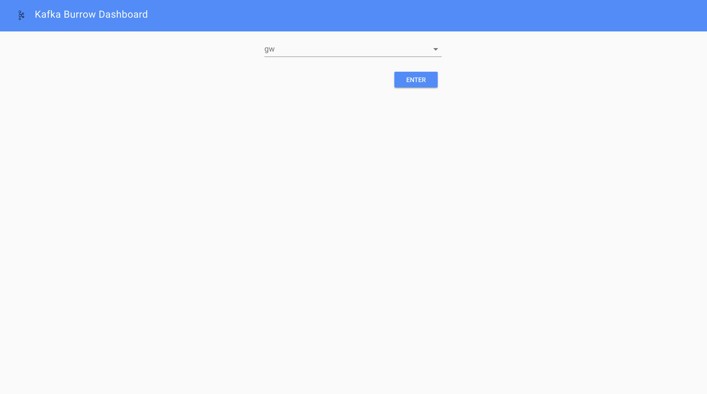
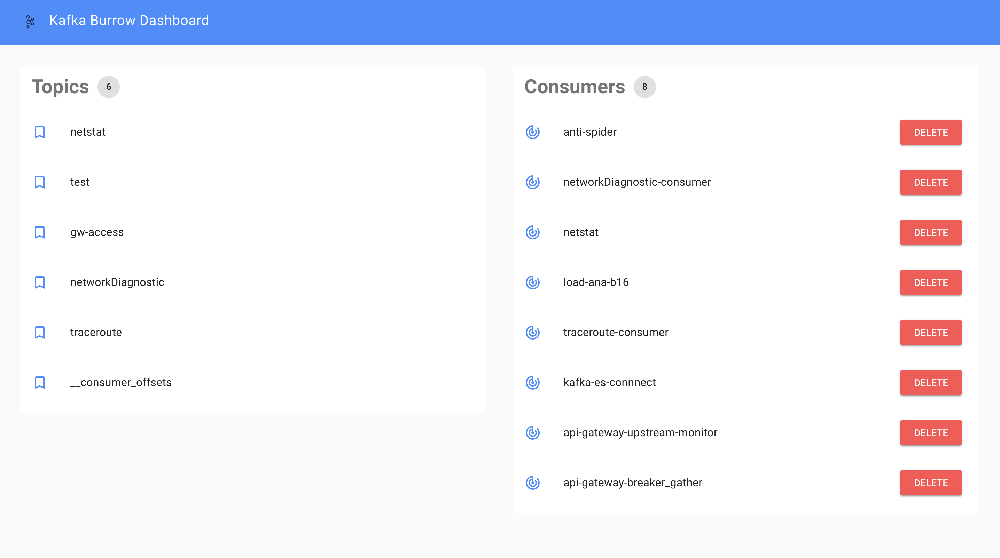
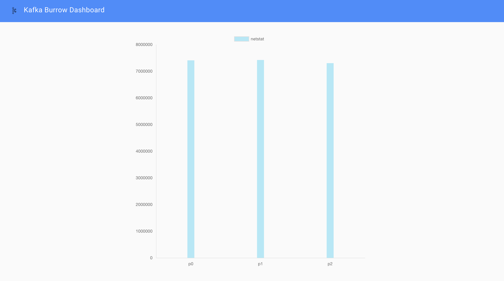
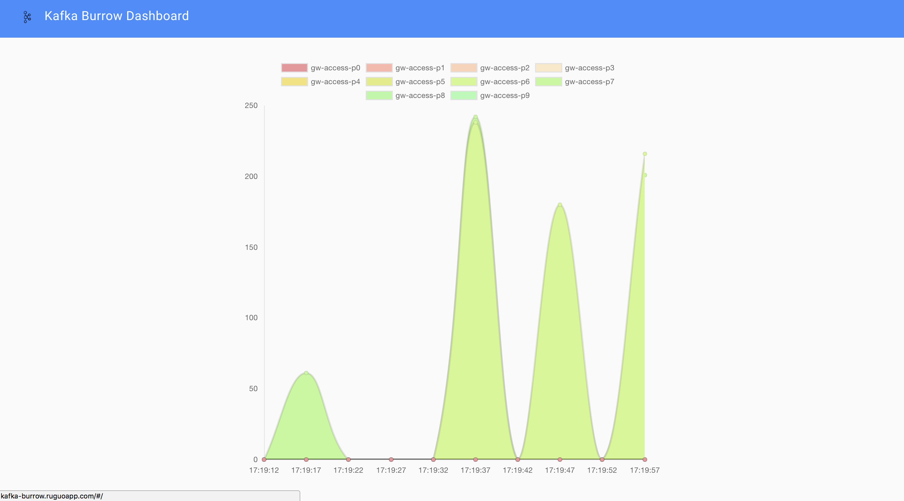

# Burrow Dashboard

Dashboard UI for Kafka Cluster monitoring with [Burrow 1.0 ](https://github.com/linkedin/Burrow) .

Only support for `/v3/kafka` API in Burrow .

## Screenshots

#### Select your kafka cluster



#### Cluster Detail



#### Topic offsets 



#### Consumer Group Status

refresh / 10s



## Usage

#### Install Burrow

##### go 

```
$ go get github.com/linkedin/Burrow
$ cd $GOPATH/src/github.com/linkedin/Burrow
$ dep ensure
$ go install
```

or your can run burrow on docker: [Docker Hub](https://hub.docker.com/r/joway/burrow-dashboard/) / [Github](https://github.com/joway/docker-burrow)

```
docker pull joway/burrow-dashboard
```

#### Configuration Burrow

burrow.toml

```toml
[general]
access-control-allow-origin="*"

[logging]
level="info"

[zookeeper]
servers=["zk:2181"]

[client-profile.kafka10]
kafka-version="0.10.1.0"
client-id="burrow-client"

[cluster.gw]
class-name="kafka"
client-profile="kafka10"
servers=["kafka1:9092"]
topic-refresh=120
offset-refresh=10

[consumer.consumer_kafka]
class-name="kafka"
cluster="gw"
servers=["kafka1:9092"]
client-profile="kafka10"
start-latest=false
offsets-topic="__consumer_offsets"
group-blacklist="^(console-consumer-|python-kafka-consumer-).*$"

[consumer.consumer_zk]
class-name="kafka_zk"
cluster="gw"
servers=["zk:2181"]
zookeeper-timeout=30
group-blacklist="^(console-consumer-|python-kafka-consumer-).*$"

[httpserver.default]
address=":8000"

```

#### Run Burrow Dashboard

##### docker

```
$ docker run -e BURROW_BACKEND=http://your-burrow-domain joway/burrow-dashboard:latest

```

##### npm

```
$ vim src/apis.js // change `baseApi` variable to http://your-burrow-domain

$ npm run dev

```

## Deploy on kubernetes

```yaml
apiVersion: extensions/v1beta1
kind: Deployment
metadata:
  name: kafka-burrow
  namespace: infra
  labels:
    app: kafka-burrow
spec:
  replicas: 1
  selector:
    matchLabels:
      app: kafka-burrow
  template:
    metadata:
      labels:
        app: kafka-burrow
    spec:
      imagePullSecrets:
      - name: docker.in
      nodeSelector:
        role: infra
      containers:
      - name: kafka-burrow
        image: joway/docker-burrow
        env:
        - name: ZOOKEEPER_SERVERS
          value: '"zk:2181"'
        - name: KAFKA_BROKERS
          value: '"kafka1:9092","kafka2:9092"'
        - name: KAFKA_VERSION
          value: 0.10.1.0
        ports:
        - containerPort: 8000
          name: api
          protocol: TCP
      - name: kafka-burrow-dashboard
        image: joway/burrow-dashboard:latest
        env:
          - name: BURROW_BACKEND
            value: http://kafka-burrow-svc:8000
        ports:
        - containerPort: 80
          name: web
          protocol: TCP
---
apiVersion: v1
kind: Service
metadata:
  name: kafka-burrow-svc
  namespace: infra
  labels:
    app: kafka-burrow
spec:
  ports:
  - port: 8000
    name: api
    targetPort: 8000
  - port: 80
    name: web
    targetPort: 80
  selector:
    app: kafka-burrow
```
